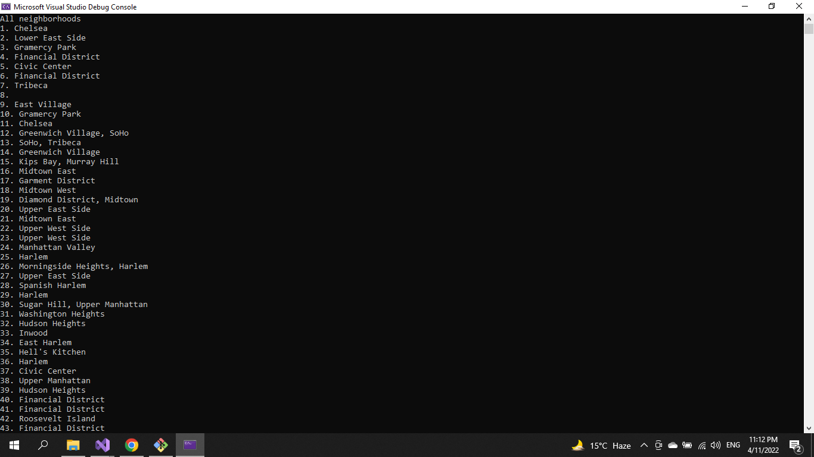

# Lab09-LINQ

### Program brings in data from an external json file, reads the data, and can filter the data based on specified values.

### Program have queries for:

1- Output all of the neighborhoods in data list 

2- Filter out all the neighborhoods that do not have any names 

3- Remove the duplicates

4- consolidate into one single query

5- Rewrite query with LINQ method

### To run program press ctrl + f5

### Results

